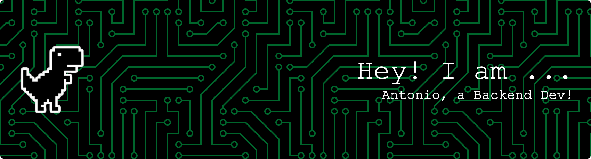

<h1 align="center">Hi 👋, I'm Antonio</h1>
<h3 align="center">A geeky and passionate backend (and IaaS) developer from Spain!</h3>

  

- 🔭 I’m currently working at **Eventbrite**

- 📫 How to reach me **Please use LinkedIn!**

- 📄 Know about my experiences [My LinkedIn!](http://linkedin.com/in/antoniogvergara/)

- ⚡ Fun fact **Probably I'm one of the few persons you'll meet with a big boardgame collection! :game_die: **

<h3 align="left">Connect with me:</h3>

<h3 align="left">Languages and Tools:</h3>

                      

